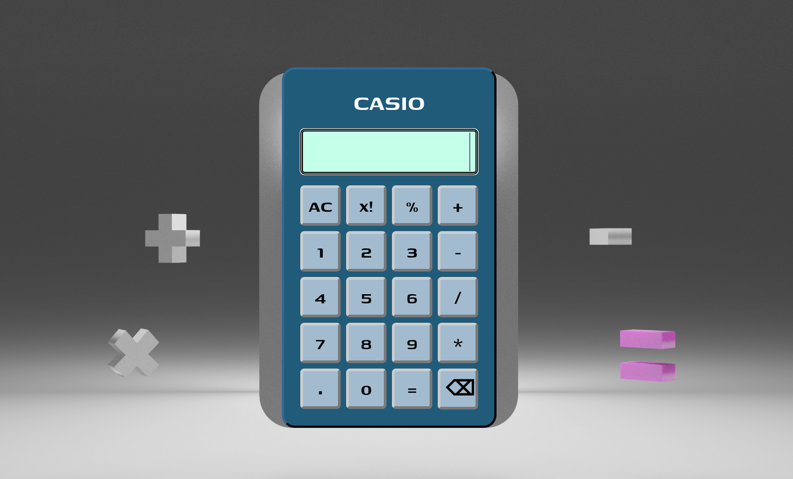

<h1>CALCULATOR project</h1>

<h3>Description</h3>

Built an on-screen calculator.

<h3><a href="https://vjharan.github.io/calculator_project/">view project</a></h3>

<h3>Project Screenshot</h3>

<h3>Features</h3>
<ul>
    <li>Perform basic mathematical operations</li>
    <li>Supports keyboard input</li>
    <li>Supports on-screen button input</li>
    <li>Displays error when invalid operations are performed</li>
    <li>Forbids alphabets from being entered into keyboard</li>
    <li>Calculates result of operation only on a pair of numbers at a time</li>
</ul>

<h3>Operating the Calculator:</h3>
<ul>
    <li>Users can input numbers directly from keyboard and press 'Enter' key to view result.</li>
    <li>Users can click buttons on the calculator to input numbers and click '=' button to view result.</li>
    <li>Click 'AC' button to clear the display, or if "Error!" is displayed on calculator screen.</li>
    <li>Click backspace ⌫ button to remove wrong input</li>
    <li>Calculation is performed only on a pair of numbers at a time, and the result can used for further calculation. </li>
    <li>Pressing on any key other than numbers [0-9], operators [+-/*%!], 'Backspace' or 'Enter' key on the keyboard, will return an error message</li>
</ul>

<h3>Technologies used</h3>
<ul>
    <li>HTML5</li>
    <li>CSS</li>
    <li>JavaScript</li>
</ul>
